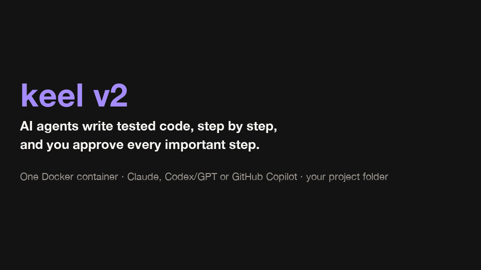

# keel v2

AI agents write **tested** code for your project. You approve the important steps.
Everything runs in one Docker container.



## Start

You need [Docker](https://docs.docker.com/get-started/get-docker/).

**1. Install keel** (once)

```bash
curl -fsSL https://raw.githubusercontent.com/MiladNalbandi/keel-v2/main/install.sh | bash
```

**2. Start it for your project** (a git folder). Your browser opens http://localhost:8080.

```bash
keel2 start ~/path/to/your/project
```

**3. Log in:** **Connections › Set up login**, then pick Claude, Codex or GitHub Copilot.

**4. Start work:** **Flow › Start a flow**. Write what you want. Approve when keel asks you (◆).

## How it works

```
 you: "show each player's rank"
         │
         ▼
  1. spec     an agent writes what to build              ◆ you approve
  2. test     an agent writes a test that fails
  3. code     an agent writes code until the test passes ◆ you approve
  4. review   agents check the whole change              ◆ you approve
         │
         ▼
 done: tested commits on a new branch. keel never pushes.
```

## What you see

| Page | What it shows |
|---|---|
| **Flow** | the running flow, step by step |
| **Inbox** | everything that waits for you |
| **Tasks** | your tasks or Jira tickets; **Start** runs a flow for one |
| **Repo · Map · Graph** | the code, the database diagram, and what uses what |
| **Budget** | tokens and cost (a small bar shows it on top of every page) |

## Flows

| Flow | Use it to |
|---|---|
| **feature** | build something new |
| **change** | make a small change |
| **fix** | fix a bug (first a test that shows it) |
| **diagnose** | find a bug you cannot repeat yet |
| **review** | review your branch (it changes nothing) |
| **lint** | fix formatting and lint problems |
| **cover** | add tests for the changed lines |
| **ship** | final checks and the pull request text |
| **hunt** | look for bugs |
| **init** | set up a project for keel |

## Commands

| Command | What it does |
|---|---|
| `keel2 start [folder]` | start keel |
| `keel2 stop` | stop keel |
| `keel2 status` | is keel running? |
| `keel2 update` | get the newest version |
| `keel2 doctor` | find problems and say how to fix them |
| `keel2 help` | all commands |

**Something wrong?** Run `keel2 doctor`. It tells you what to do.

## More

- [Guide](docs/GUIDE.md): run modes, Tasks and Jira, logins, Docker mode, MCP, and how to build keel yourself
- [How the parts talk](docs/CONTRACT.md)

## License

MIT, see [LICENSE](LICENSE).
